# Sprinto Shop

A Flutter shopping app for browsing and exploring camera products, lenses, and accessories.

## Features

* Welcome Screen
* Sign Up & Sign In
* Form validation
* Animated navigation
* Featured categories using PageView
* Products displayed in a responsive GridView
* Add to Cart interaction with SnackBar feedback
* Hot Offers section
* English & Arabic localization
* Responsive UI

## Technologies

* Flutter
* Dart
* Material Design
* Easy Localization

## Localization

The app supports two languages:

* English
* Arabic

All main UI texts, product sections, offers, and buttons are localized.

## Project Structure

lib/
├── models/
├── routes/
├── screens/
└── widgets/
└── main.dart

assets/
├── images/
├── translations/
└── fonts/

screenshots/

## Getting Started

### Prerequisites

Make sure you have Flutter installed on your machine.

### Installation

1. Clone the repository:
git clone YOUR_GITHUB_REPOSITORY_LINK

2. Navigate to the project folder:
cd sprints_project

3. Install dependencies:
flutter pub get

4. Run the application:
flutter run

## Screenshots

### Welcome Screen

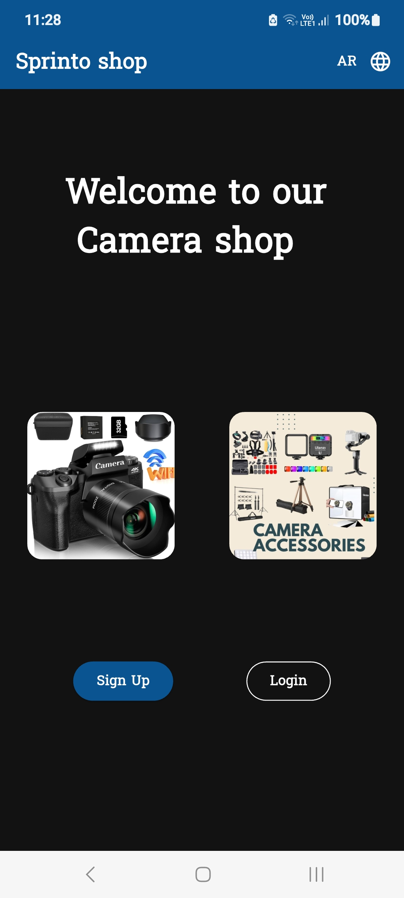
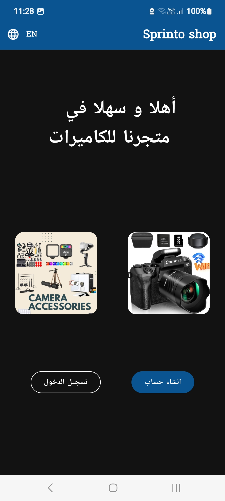

### Login / Sign Up

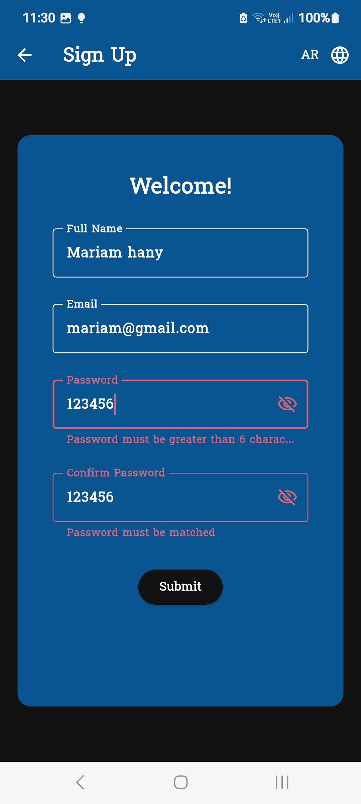
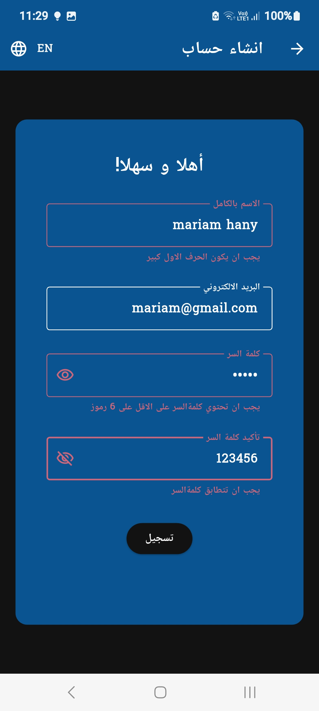
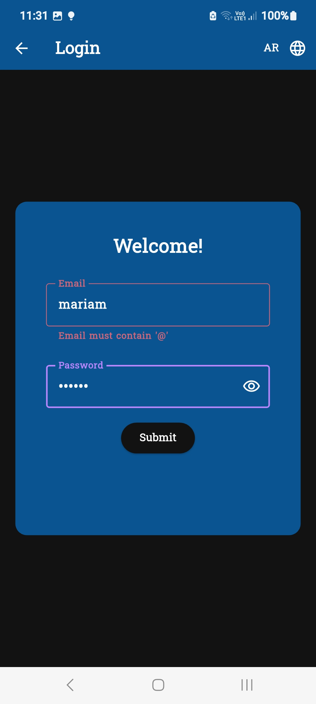
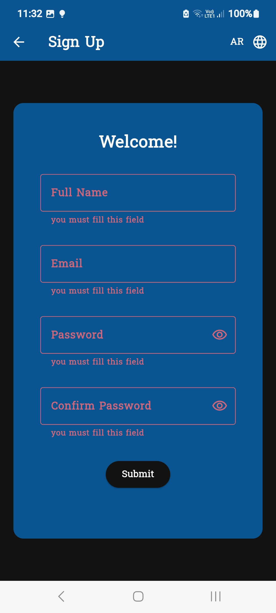

### Success Dialog

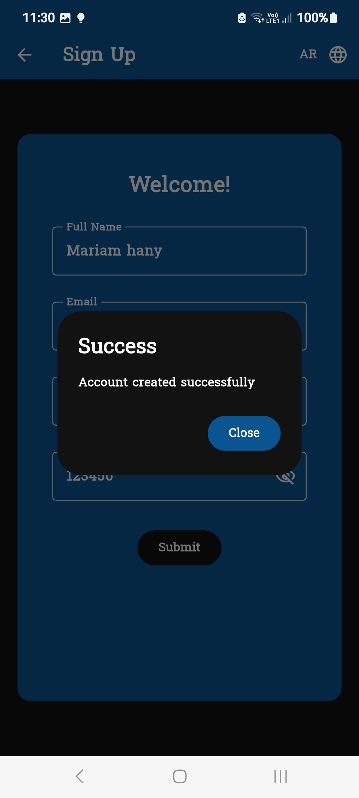
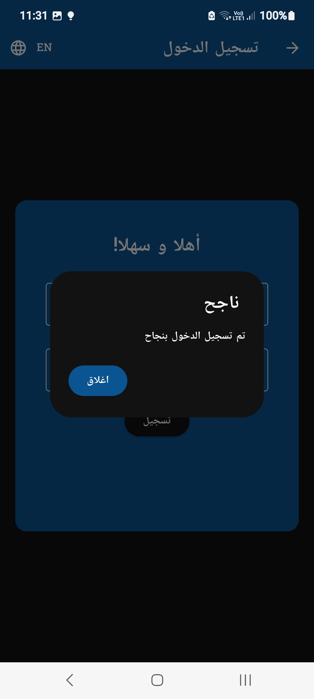

### Home Screen

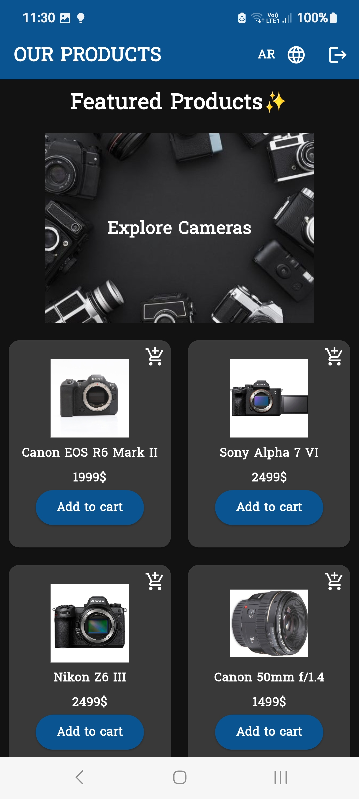
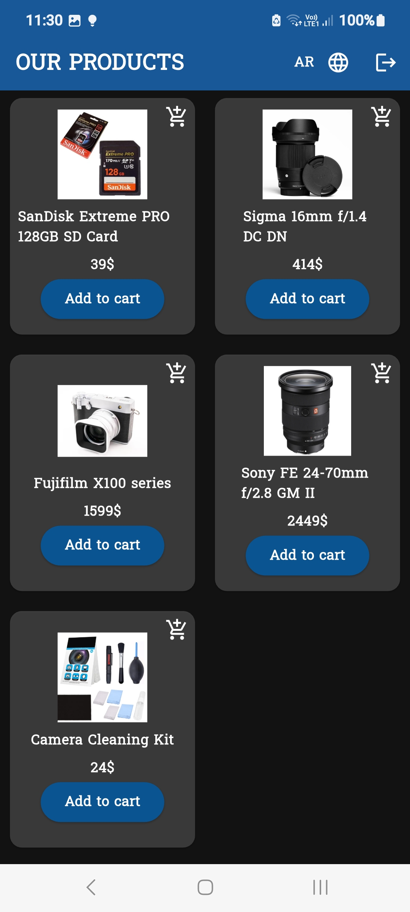
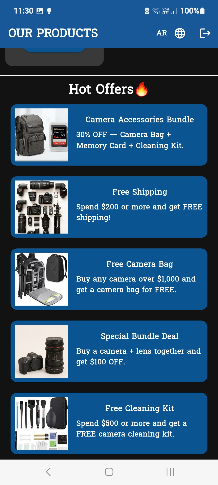
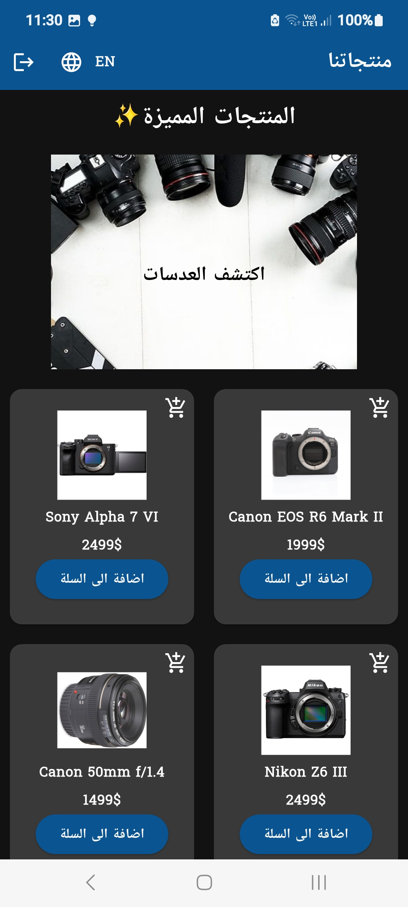
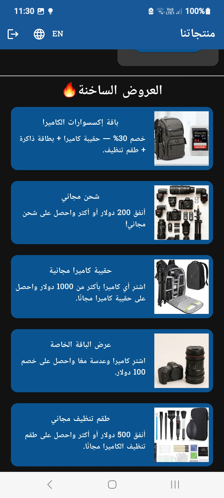

### Added snackBar

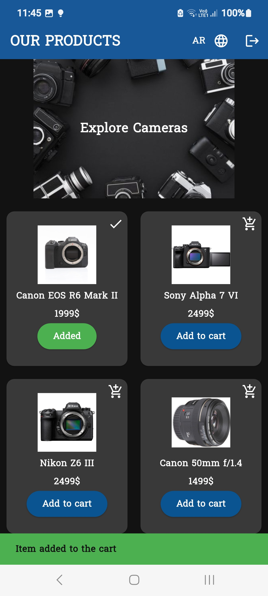
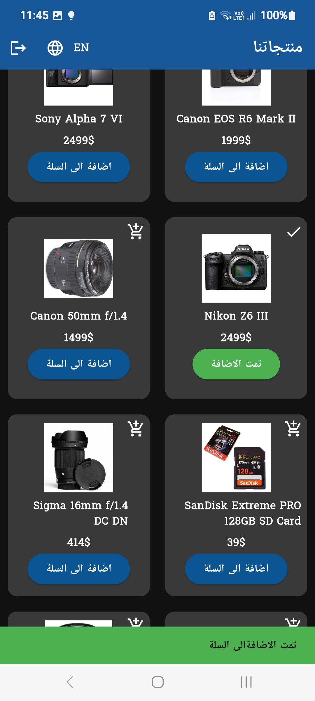

## Author

**Mariam Hany**

Computer Science & Artificial Intelligence Student
